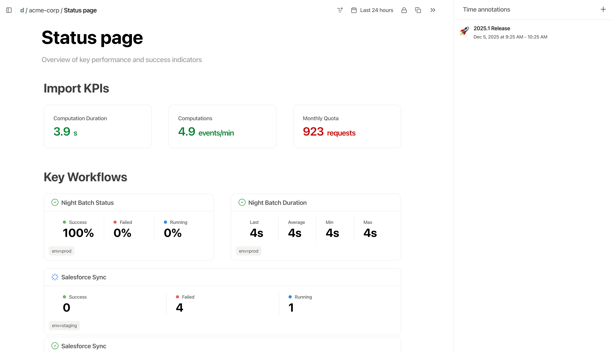

# DashFrog

Customer-scoped observability for B2B SaaS



## What is DashFrog?

DashFrog is open-source observability built around your customers, not your infrastructure.

It sits on OpenTelemetry but abstracts away the complexity. Customer namespaces are auto-created as you push data. Anyone on your team can explore what's happening with a customer — no PromQL, no trace IDs.

**Not a replacement for dev observability.** Keep using Datadog, Grafana, or whatever you use for infrastructure monitoring. DashFrog complements them by organizing telemetry per customer — making it easy for support, account managers, and customers themselves to understand what's happening.

**Key Features:**
- 🎯 **Customer-first** - Organize telemetry by customer, not infrastructure
- ⚡ **Zero config** - Customer namespaces auto-created as data arrives
- 🔍 **No query languages** - Explore without PromQL or trace IDs
- 📊 **Shareable insights** - Give customers visibility into their own data

## Try the Demo

See DashFrog in action with a 2-minute demo:

**Step 1: Install DashFrog**

```bash
# setup demo dir
mkdir dashfrog-demo && cd dashfrog-demo
/bin/bash -c "$(curl -fsSL https://raw.githubusercontent.com/towlabs/dashfrog/main/bin/deploy)"
```

This installs DashFrog with Docker Compose and exposes:
- **API/UI** on http://localhost:8000 (login: `admin` / `admin`)
- **OTLP endpoints** on ports 4317 (gRPC) and 4318 (HTTP)

**Step 2: Run the demo**

```bash
# Install dependencies
python -m venv .venv && source .venv/bin/activate
pip install dashfrog requests

# Download and run the demo script
wget https://raw.githubusercontent.com/towlabs/dashfrog/main/dashfrog/demo-app/demo.py
python demo.py
```

The demo will:
1. Generate flows and metrics for 3 sample customers
2. Create status page notebooks with live data
3. Print direct links to view the notebooks

Open the links in your browser to explore the data!

> **For production:** See the [Deployment Guide](docs/deployment.md) for Kubernetes, custom configuration, and security hardening.

## Key concepts

### Flows

Flows let you follow a distributed workflow as logical steps.

You define a flow in your code. DashFrog tracks it across services using OpenTelemetry. Your support team sees "customer X's import is stuck at validation" — not span IDs and service graphs.

```python
from dashfrog import flow, step

# Start a flow for a customer
with flow.start(
    name="customer_data_import",  # flow name
    tenant="acme-corp",  # tenant name
    env="prod"  # optional labels
):
    # Each step is tracked
    with step.start("validate_data"):
        # validation logic
        validate_csv(file)

    with step.start("transform_data"):
        # transformation logic
        transform(data)

    with step.start("load_to_database"):
        # database logic
        db.insert(data)
```

Flow data is automatically available in notebooks, where you can query and visualize workflows per customer.

→ See [Flows documentation](docs/flows.md) for distributed flows, error handling, and advanced usage.

### Metrics

Metrics use standard OTel under the hood. DashFrog presents them so you don't need to know what a gauge, counter, or histogram is.

```python
from fastapi import FastAPI
from dashfrog import metrics

app = FastAPI()

computation_duration = metrics.Histogram(
    "computation_duration", labels=["env"], pretty_name="Computation Duration", unit="s"
)
computation_count = metrics.Counter("computation_count", labels=["env"], pretty_name="Computations")

@app.get("/heavy-computation/{customer_id}/{env}")
async def heavy_computation(customer_id: str, env: str):
    duration = sleep(3)
    computation_duration.record(duration, tenant=customer_id, env=env)
    computation_count.add(1, tenant=customer_id, env=env)
```

Metrics data is automatically available in notebooks for querying and visualization.

→ See [Metrics documentation](docs/metrics.md) for histograms, percentiles, labels, and best practices.

## Notebooks

Build customer-specific dashboards with a block-based editor. Combine metrics and flows to create views you can share publicly with customers or use internally for support.

**Features:**
- Drill-down into historical data by clicking any metric or flow
- Share public notebooks via URL
- Add time annotations for releases, incidents, and events

→ See [Notebooks documentation](docs/notebooks.md) for details

## Roadmap

Ideas we're exploring:
- External data sources(API, Prometheus, ...)
- Helpdesk integrations (Zendesk, Intercom)
- Alerting rules

## License

MIT License - see [LICENSE](LICENSE) for details.