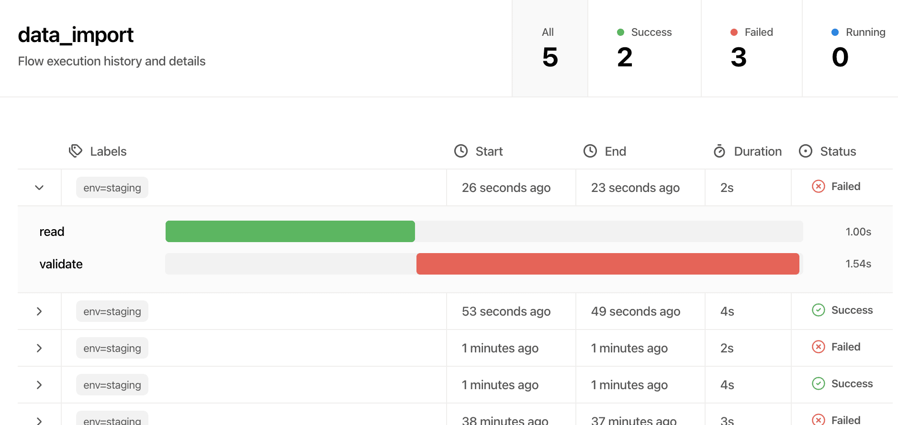

# Flows



Flows let you track distributed workflows from your customer's perspective.

## What Are Flows?

A flow represents a customer-scoped workflow — like processing an order, importing data, or handling a webhook. Each flow consists of **steps** that track logical operations, not technical spans.

**What you get:**
- Track workflows per customer (tenant)
- See which step a workflow is currently on or failed at
- Follow workflows across multiple services
- Query flows by customer, status, or custom attributes
- Use flow data in notebooks for customer-facing reports

## Basic Usage

### Starting a Flow

```python
from dashfrog import flow, step, setup

# Initialize DashFrog
setup()

# Start a flow for a customer
with flow.start(
    name="data_import",
    tenant="acme-corp",  # customer ID
):
    with step.start("validate"):
        validate_data()

    with step.start("process"):
        process_data()

    with step.start("store"):
        store_results()
```

**For a complete flow example**, see [`basic_flow.py`](https://github.com/towlabs/dashfrog/blob/main/dashfrog/demo-app/basic_flow.py)

### Flow Parameters

#### Required Parameters

- **`name`** (str): Flow name (e.g., "data_import", "payment_processing")
- **`tenant`** (str): Customer/tenant ID this flow belongs to

#### Optional Parameters

You can add any labels as keyword arguments:

```python
with flow.start(
    name="webhook_processing",
    tenant="acme-corp",
    webhook_type="stripe.payment.success",
    env="production",
):
    # flow logic
    pass
```

These attributes appear in the DashFrog UI for filtering and search.

## Distributed Flows

Flows automatically track across services using OpenTelemetry's distributed context propagation.

### Automatic Propagation

> **Note:** Automatic propagation only works if your libraries are instrumented with OpenTelemetry.
>
> DashFrog provides instrumentation wrappers for common frameworks:
> - `with_fastapi(app)` - Instruments FastAPI applications
> - `with_celery(app)` - Instruments Celery workers
> - `with_requests()` - Instruments requests library
> - `with_httpx()` - Instruments httpx library
> - `with_flask(app)` - Instruments Flask applications

If you're using instrumented HTTP clients, context propagates automatically:

**Service A:**
```python
from dashfrog import flow, with_requests
import requests

# Initialize DashFrog
setup()
with_requests()

with flow.start(name="order_processing", tenant="customer-123"):
    # This HTTP call automatically propagates flow context
    response = requests.post("http://service-b/process", json=order)
```

**Service B:**
```python
from dashfrog import step, with_fastapi
from fastapi import FastAPI

app = FastAPI()

# Initialize DashFrog
setup()
with_fastapi(app)

@app.post("/process")
async def process_order(order: dict):
    # This step is part of the same flow from Service A
    with step.start("process_payment"):
        process_payment(order)

    return {"status": "success"}
```

**For a complete distributed flow example**, see [`distributed_flow.py`](https://github.com/towlabs/dashfrog/blob/main/dashfrog/demo-app/distributed_flow.py)

### Async Task Flows (Advanced)

For async tasks where a flow starts in one service but completes asynchronously in another, use `end_on_exit=False`:

**Use case:** API enqueues a Celery task, worker processes it. The flow should remain open until the worker finishes.

> **Note:** Make sure Celery is instrumented with `with_celery(app)` for automatic context propagation.

**API (Producer):**
```python
@app.post("/process-data/{customer_id}")
async def process_data_endpoint(customer_id: str, data: dict):
    # Start flow but don't end it when context exits
    with flow.start(
        name="async_data_processing",
        tenant=customer_id,
        end_on_exit=False  # Flow stays open
    ):
        process_data_task.apply_async(
            args=[customer_id, data]
        )

    # Flow is still "running" after returning response
    return {"status": "processing", "flow_id": flow_id}
```

**Celery Worker (Consumer):**
```python
from celery import Celery
from dashfrog import flow, step

app = Celery("tasks")

@app.task
def process_data_task(customer_id: str, data: dict):
    # These steps are added to the existing flow
    with step.start("process_data"):
        result = process(data)

    with step.start("store_results"):
        store(customer_id, result)

    with step.start("send_notification"):
        notify_customer(customer_id, "Processing complete")

    # Explicitly end the flow when done
    flow.success()

    return {"status": "success"}
```
